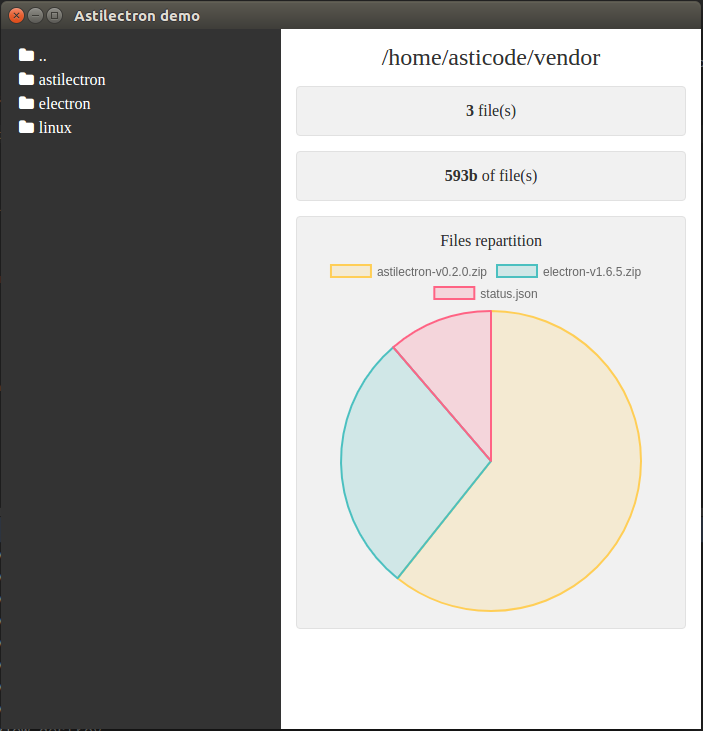

This package is a demo of an [astilectron](https://github.com/asticode/go-astilectron) app that uses the [bootstrap](https://github.com/asticode/go-astilectron-bootstrap) and the [bundler](https://github.com/asticode/go-astilectron-bundler).

It's also the subject of this [blog post](https://medium.com/@social_57971/how-to-add-a-gui-to-your-golang-app-in-5-easy-steps-c25c99d4d8e0).



# Step 1: install the demo

Run the following commands:

    $ go get -u github.com/asticode/go-astilectron-demo/...
    $ rm {root_of_this_repo}/bind.go 

# Step 2: install the bundler

Run the following command:

    $ go get -u github.com/asticode/go-astilectron-bundler/...
    $ go install github.com/asticode/go-astilectron-bundler/astilectron-bundler

Go get and build the binary.
And don't forget to add `$GOPATH/bin` to your `$PATH`.

# Step 3: bundle the app for your current environment

Run the following commands:

    $ cd {root_of_this_repo}
    $ astilectron-bundler

# Step 4: test the app

The result is in the `output/<your os>-<your arch>` folder and is waiting for you to test it!

# Step 5: bundle the app for more environments

To bundle the app for more environments, add an `environments` key to the bundler configuration (`bundler.json`):

```json
"environments": [
  {"arch": "amd64", "os": "linux"},
  {"arch": "386", "os": "windows"}
]
```

and repeat **step 3**.
